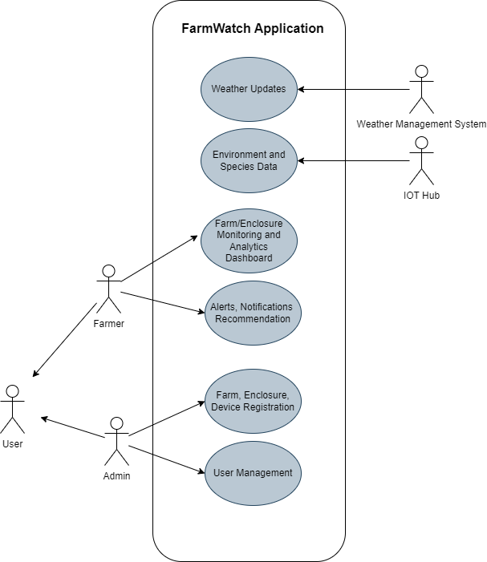

# Table of Contents
[**Executive Summary:**	](#_wbdnd3caxy5s)**1****

[**Introduction:**	](#_jilsipjjf092)**2**

[**Business Requirements**	](#_mt9su15bmkh5)**2**

[**Non-Functional Requirements (NFRs)**	](#_cpqe7fquib4m)**3**

[**Assumptions**	](#_lz8g7itxesnn)**6**

[**Architecture Decision Records**	](#_avd4ej39x2dy)**7**

[Solution	](#_tj5z8la3ilsg)7

[Structure	](#_jia34xbl9ccl)8

[Dependencies	](#_9vc3dflxwgg3)10

[Interfaces	](#_gx5cf2i0pmev)12

[Construction techniques (libraries, frameworks, tools, and processes)	](#_tq614z71th6k)14

[Architecture Decisions	](#_p9q34y3iwqah)16

[**Deliverables**	](#_pyfjjk5gdy5o)**17**

[**Challenges:**	](#_7wej1ye1jvub)**18**

[**Business Architecture**	](#_nnhithd2ypge)**19**

[Use Case Diagram	](#_2bmml0htwm2p)20

[Journey View	](#_qg9r5qehhouq)22

[Extensibility	](#_xoob55mwcu26)32

[**ML Models**	](#_7mia3owu2t59)**32**
#
# Executive Summary:
FarmWatch has introduced Species and Environment Management Dashboard (SEMD) which is an advanced solution designed to address the challenges faced in managing diverse species and environmental conditions within farming enclosures. Leveraging IoT (Internet of Things) architecture and machine learning algorithms, FarmWatch’s SEMD offers comprehensive farm and enclosure management, real-time monitoring, decision support, and predictive analytics. The platform ensures high performance, reliability, scalability, security, and interoperability, making it suitable for various farming applications including fish farming, cattle farming, zoo monitoring, and bird monitoring.
# Introduction:
Traditional farming operations often face complexities in managing multiple species and environmental factors across various enclosures. FarmWatch’s Species and Environment Management Dashboard (SEMD) aims to revolutionize farming practices by providing a centralized platform for efficient farm and enclosure management, real-time monitoring of species and environmental metrics, intelligent decision support, and predictive analytics. By leveraging IoT devices and machine learning algorithms, FarmWatch’s SEMD empowers farmers with actionable insights to optimize production, ensure animal welfare, and enhance overall farm productivity.
# Business Requirements
The Species and Environment Management Dashboard (SEMD) aims to address the challenges faced in managing diverse species and environmental conditions within farming enclosures. The key requirements include:

- Farm and Enclosure Management: Enable farmers to register and manage farms and enclosures effectively.
  - Farm/Enclosure Registration: Provide functionality for farmers to register new farms and enclosures within the system.
  - Farm and Enclosure Monitoring based on Species and Environment Matrix:Monitor farms and enclosures based on species composition and environmental factors.
  - Species Count Monitoring per Enclosure:Track the number of individual species present in each enclosure.
- Environment Matrix Monitoring:
  - Monitor environmental parameters including:
    - Oxygen Level
    - pH Level
    - Temperature
    - Salinity
    - Configurable attributes and thresholds for environmental monitoring.
- Species Metrics Monitoring:
  - Monitor species metrics including:
    - Type (Fish/ Crabs/ Cattle)
    - Size
    - Behavior
    - Lifecycle
    - Health
    - Configurable attributes and thresholds for species monitoring.
- Decisioning:
  - Provide decision support for farmers including:
    - Harvesting decisions
    - Treatment recommendations
    - Action recommendations
    - Future milestone predictions
- Alerts and Notifications:
  - Generate alerts and notifications for:
    - Environmental metrics thresholds
    - Species metrics thresholds
    - Device status
    - Device management and servicing requirements
- Device Management:
  - Implement functionality for:
    - Device registration
    - Device monitoring
    - Device servicing (updates)
- Environment Type (Land/ Water/ Air):
  - Classify enclosures based on the type of environment they represent (e.g., land, water, air).

# Non-Functional Requirements (NFRs)
Non-Functional Requirements (NFRs) derived from the problem statement:

|**NFR**|**Rational**|
| :- | :- |
|Performance (Real-Time Alerts)|Ensure that the system can generate and deliver real-time alerts to farmers and stakeholders within acceptable response times.|
|Reliability (Accuracy of Data and Output)|Guarantee the accuracy of collected data and generated output to facilitate informed decision-making by farmers.|
|Availability (System Availability)|
Maintain high availability of the system to ensure that insights and functionalities are accessible to users without interruption.

|
|Scalability (System Scalability)|Design the system to scale seamlessly to accommodate an increasing number of tenants, enclosures, and devices as the user base grows.|
|Security (Secure by Design)|Implement robust security measures to protect sensitive data, ensure secure communication, and prevent unauthorized access.|
|Durability|
Ensure the durability of stored data by implementing reliable storage mechanisms and backup solutions to prevent data loss.

|
|Observability (Monitoring)|
Provide comprehensive monitoring capabilities to track the health and performance of devices, species, infrastructure, and applications.

|
|Traceability|Maintain traceability of data and system operations to track changes, identify issues, and ensure compliance with regulations.|
|Monetization (Tenant/Enclosure/Devices Based)|Enable monetization opportunities by offering subscription plans or usage-based pricing models based on the number of tenants, enclosures, and devices.|
|Accessibility|
Ensure that insights and functionalities are accessible to users across different devices and platforms to support diverse user needs and preferences.

|
|Interoperability (Solution Compatible with Industry Standard Hardware Devices)|Ensure compatibility with industry-standard hardware devices to facilitate seamless integration and interoperability with existing infrastructure.|
|Edge Computing (Weak Network)|
Implement edge computing capabilities to support operations in areas with weak network connectivity, enabling local processing and decision-making.

|
|Reusability (Solution Can Be Used for Similar Implementations)|Design the solution with modularity and flexibility to facilitate reuse in similar implementations, such as cattle farming or aquarium management, with minimal modifications.|

# Assumptions

|**Category**|**Assumption**|**Rational**|
| :- | :- | :- |
|**Physical Sensors in Every Enclosure**|**Physical sensors are deployed in each enclosure to capture environmental data and   species metrics.**|**The sensors have firmware memory to store data temporarily if they lose network connectivity, allowing them to transmit the persisted data to the IoT Hub once connectivity is restored.**|
|**Single Species per Enclosure**|**Each enclosure houses only one type of species.**|**This simplifies species monitoring and management within enclosures, allowing for  more accurate tracking of species-specific metrics.**|
|**Feeder Control Devices Available:**|**Feeder control devices are installed in the enclosures and can be controlled remotely by the SEMD application.**|**Feeding control is an important aspect of farm management, and having feeder control devices allows for automated feeding based on system recommendations.**|
|**Decision Review by Farmer/Farming Team**|**Any decision or recommendation generated by the SEMD application undergoes review by the farmer or farming team before execution.**|**Human oversight is crucial for critical decisions regarding harvesting, treatment, and other actions to ensure alignment with farming objectives and practices.**|
#
# Architecture Decision Records
## Solution
The approach to designing FarmWatch’s SEMD involves the following key components:

**Farm and Enclosure Management:**

FarmWatch’s SEMD facilitates easy registration and management of farms and enclosures, allowing farmers to monitor and control operations efficiently.

**Real-time Monitoring:**

IoT sensors deployed in every enclosure capture environmental data such as oxygen level, pH level, temperature, and salinity in real-time. Species metrics such as count, size, behavior, health and lifecycle are also monitored continuously.

**Decision Support:**

FarmWatch’s SEMD provides actionable recommendations based on environmental and species metrics, enabling farmers to make informed decisions regarding harvesting, treatment, and future milestones prediction.

**Predictive Analytics:**

Machine learning algorithms analyze historical data to predict future milestones, harvest quantities, medication requirements, and environmental recommendations, enhancing farm planning and management.

**Alerts and Notifications:**

The platform generates alerts and notifications for threshold breaches in environmental and species metrics, device status, and servicing requirements, ensuring timely intervention and maintenance.

**Device Management:**

FarmWatch’s SEMD offers comprehensive device management capabilities, including registration, monitoring, and servicing, ensuring the reliability and availability of IoT sensors and control devices.

**Scalability and Reusability:**

The architecture of FarmWatch’s SEMD is designed to scale seamlessly to accommodate a growing number of farms and enclosures, making it suitable for various farming applications beyond fish farming, such as cattle farming, zoo monitoring, and bird monitoring.

By adopting FarmWatch’s SEMD, farmers can streamline their operations, optimize resource utilization, and improve overall productivity while ensuring animal welfare and environmental sustainability.

## Structure 
To design the structure of the Species and Environment Management Dashboard (SEMD) system, a modular and scalable approach is essential. Here's a proposed structure based on microservices architecture:

1\. Microservices Architecture:

- Device Management Microservice:
  - Responsible for device registration, monitoring, and servicing.
  - Manages the lifecycle of IoT devices, including registration, health monitoring, and firmware updates.
- Data Ingestion Microservice:
  - Handles the ingestion of data streams from registered devices.
  - Validates and preprocesses incoming data before storing it in the database.
- Data Processing Microservice:
  - Performs real-time processing and analysis of collected data.
  - Implements machine learning algorithms for species and environmental monitoring, decision support, and predictive analytics.
- Dashboard Microservice:
  - Provides a user interface for farmers and stakeholders to visualize data and insights.
  - Includes features for monitoring, alerting, notifications, and decision-making.
- Integration Microservice:
  - Facilitates integration with external systems and services.
  - Implements APIs and webhooks for communication with third-party systems (e.g., weather APIs, market data providers).

2\. Database Structure:

- Environmental Data Store:
  - Stores environmental data collected from sensors, including oxygen level, pH level, temperature, salinity, and configurable attributes.
  - Utilizes a scalable and resilient database solution (e.g., NoSQL database) for efficient storage and retrieval.
- Species Data Store:
  - Stores species metrics such as type (fish/crabs/cattle), size, behavior, lifecycle, health, and configurable attributes.
  - Supports relational or document-oriented database schema to accommodate diverse species data.

3\. Communication Protocols:

- API Gateway:
  - Serves as a single entry point for client applications to access SEMD microservices.
  - Routes requests to appropriate microservices based on API endpoints.
- Message Broker:
  - Enables asynchronous communication and event-driven architecture.
  - Supports publish-subscribe messaging for real-time data processing and event notifications.

4\. Containerization and Orchestration:

- Docker Containers:
  - Containerizes each microservice for consistency and portability across different environments.
- Kubernetes Orchestration:
  - Orchestrates deployment, scaling, and management of containerized microservices.
  - Provides automatic scaling, self-healing, and load balancing capabilities.

5\. Security and Identity Management:

- Authentication and Authorization Service:
  - Handles user authentication and access control to SEMD microservices.
  - Supports OAuth 2.0 or OpenID Connect for secure authentication and authorization.
- Encryption and Data Protection:
  - Implements encryption mechanisms to protect sensitive data during transmission and storage.
  - Utilizes TLS/SSL for secure communication between microservices and clients.

## Dependencies
Dependencies for the Species and Environment Management Dashboard (SEMD) system can be categorized into technological, organizational, and external dependencies. Here's an overview:

**Technological Dependencies:**

IoT Sensors and Devices:

Dependency on the availability and proper functioning of physical sensors deployed in enclosures to capture environmental data and species metrics.

Internet Connectivity:

Dependency on stable and reliable internet connectivity to transmit data from edge devices to the cloud IoT platform and to enable remote access to the SEMD application.

Cloud Infrastructure:

Dependency on cloud service providers to host the IoT platform, databases, and machine learning models, ensuring high availability, scalability, and reliability.

Machine Learning Frameworks:

Dependency on machine learning frameworks and libraries for developing and deploying predictive analytics models for decision support and future milestone predictions.

Database Management Systems:

Dependency on database management systems for storing and managing collected data, ensuring data integrity, availability, and scalability.

Communication Protocols:

Dependency on standardized communication protocols (e.g., MQTT, HTTP) for secure and efficient data transmission between edge devices, gateways, and the cloud platform.

**Organizational Dependencies:**

Farming Teams:

Dependency on the farming teams for deploying, maintaining, and monitoring physical sensors and feeder control devices within the enclosures.

IT Support Team:

Dependency on the IT support team for managing and maintaining the cloud infrastructure, ensuring system availability, security, and performance.

Data Analysts and Scientists:

Dependency on data analysts and scientists for developing and fine-tuning machine learning models, analyzing data, and deriving actionable insights from collected data.

Farmers and Farming Practices:

Dependency on farmers for providing input data, reviewing system recommendations, and executing post-approval actions in alignment with farming objectives and practices.

**External Dependencies:**

Regulatory Compliance:

Dependency on compliance with regulatory requirements related to data privacy, security, and environmental regulations governing farming operations.

Weather Conditions:

Dependency on external weather conditions that may impact environmental parameters within enclosures, influencing farming operations and decision-making.

Hardware Suppliers:

Dependency on hardware suppliers for providing reliable and compatible IoT sensors, control devices, and feeder control mechanisms.

Third-Party Services:

Dependency on third-party services such as weather APIs, mapping services, or market data providers for enhancing decision support functionalities within the SEMD application.

Identifying and managing these dependencies is crucial for ensuring the smooth operation and success of the Species and Environment Management Dashboard (SEMD) system. Regular communication, collaboration, and contingency planning are essential to address any potential challenges or disruptions arising from these dependencies

## Interfaces
Interfaces, including APIs and published contracts, play a crucial role in defining how different components of the Species and Environment Management Dashboard (SEMD) system interact with each other. Here are the key interfaces for SEMD:

1\. Device Interface:

- APIs:
  - Device Registration API: Allows devices (sensors, control devices) to register with the SEMD system.
  - Device Monitoring API: Enables monitoring of device status, health, and connectivity.
  - Device Data Transmission API: Facilitates the transmission of data collected by devices to the cloud platform.
  - Device Servicing API: Supports remote servicing and updates of device firmware and configurations.

2\. Cloud IoT Platform Interface:

- APIs:
  - Data Ingestion API: Accepts incoming data streams from registered devices and stores them in the database.
  - Data Processing API: Processes incoming data streams for real-time monitoring, analysis, and prediction.
  - Dashboard API: Provides access to the SEMD dashboard for visualization of data and insights.
  - Alerting and Notification API: Sends alerts and notifications to farmers and stakeholders based on predefined thresholds and rules.

3\. Database Interface:

- Published Contracts:
  - Data Schema: Defines the structure and format of collected data stored in the database.
  - Data Access Contracts: Specify access permissions and protocols for querying and retrieving data from the database.

4\. Machine Learning Model Interface:

- APIs:
  - Model Training API: Allows training and updating of machine learning models using historical data.
  - Prediction API: Provides access to trained models for generating predictions and recommendations.
  - Model Evaluation API: Supports evaluation of model performance and accuracy using validation data sets.

5\. User Interface (Dashboard) Interface:

- APIs:
  - User Authentication API: Handles user authentication and access control to the SEMD dashboard.
  - Visualization API: Enables the rendering of data and insights in the dashboard interface.
  - User Interaction API: Supports user interactions such as filtering, sorting, and drill-down functionalities.

6\. External System Interface:

- APIs:
  - Integration APIs: Facilitate integration with third-party systems or services such as weather APIs, market data providers, or regulatory compliance platforms.
  - Webhooks: Allow external systems to subscribe to SEMD events and receive real-time updates or notifications.

7\. External Device Interface:

- APIs:
  - Device Integration API: Enables integration with external hardware devices or systems that are not directly managed by SEMD, such as weather stations or environmental monitoring systems.

These interfaces define the interactions and communication protocols between different components of the SEMD system, enabling seamless integration, data exchange, and interoperability. Regular documentation and versioning of interfaces are essential to ensure consistency, compatibility, and maintainability of the system over time

## Construction techniques (libraries, frameworks, tools, and processes)

To ensure interoperability between AWS, GCP, and Azure while building the proposed architecture for the Species and Environment Management Dashboard (SEMD), a combination of libraries, frameworks, tools, and processes will be used. Here's a breakdown of the construction techniques:

Containerization and Orchestration:

Docker: Use Docker to containerize microservices and ensure consistency in deployment across different cloud platforms.

Kubernetes: Utilize Kubernetes for orchestration to manage containerized applications and ensure scalability and resilience across cloud providers.

Cross-Platform Development Frameworks:

Spring Boot: For Java-based microservices development, as it provides a lightweight and modular framework suitable for building cloud-native applications.

Node.js: For building server-side applications and APIs, providing flexibility and scalability.

Python Flask/Django: For rapid development of RESTful APIs and microservices, offering ease of integration with machine learning models and data processing pipelines.

Cross-Platform Data Storage and Processing:

Apache Kafka: For building real-time data pipelines and event-driven architectures, enabling seamless data integration across cloud platforms.

Apache Spark: For distributed data processing and analytics, supporting interoperability with various data sources and formats.

Apache Cassandra: For scalable and fault-tolerant distributed database management, ensuring data consistency and availability across cloud providers.

Cross-Platform Integration and Messaging:

Apache Camel: For building integration pipelines and message routing between different systems and services, supporting various protocols and data formats.

RabbitMQ: For implementing message queuing and pub/sub messaging patterns, facilitating communication and data exchange between microservices and components.

API Gateway and Service Mesh:

Kong: For API gateway management and traffic routing, providing a unified entry point for accessing microservices across cloud platforms.

Istio: For implementing service mesh architecture, enabling secure and reliable communication between microservices deployed in different environments.

Cross-Platform Monitoring and Observability:

Prometheus: For monitoring system metrics and performance, offering support for multi-cloud environments through exporters and integrations.

Grafana: For visualization and analysis of monitoring data, providing dashboards and alerts for proactive management and troubleshooting.

ELK Stack (Elasticsearch, Logstash, Kibana): For log management and analysis, enabling centralized logging and real-time monitoring across cloud platforms.

Continuous Integration and Deployment (CI/CD):

Jenkins: For orchestrating CI/CD pipelines and automating build, test, and deployment processes across AWS, GCP, and Azure.

GitLab CI/CD: For integrated CI/CD capabilities, enabling seamless integration with version control and collaboration tools.

Cross-Platform Authentication and Authorization:

OAuth 2.0/OpenID Connect: For implementing authentication and authorization protocols, ensuring secure access control to SEMD services and resources.

Keycloak: For centralized identity and access management (IAM), providing single sign-on (SSO) and fine-grained access control across cloud platforms.

By leveraging these construction techniques and tools, the SEMD system can be built with interoperability in mind, allowing seamless deployment and integration across AWS, GCP, and Azure environments.

## Architecture Decisions

|Title|Architecture Pattern|
| :- | :- |
|Status (Proposed, accepted, supersded)|Accepted|
|Context|The application needs to detect events from the data being monitored by devices, weather information and communicate the appropriate notification to the farmer|
|Decision|**Event Driven Microservices Architecture** - This will enable to read the triggers generated by devices and communicate the same with appropriate microservice to take further action. Microservices for different types of processes will be created so that there is no tight coupling at business layer|
|Consequences|Availability, Scalability|

|Title|Site-wide local IoT Hub|
| :- | :- |
|Status (Proposed, accepted, supersded)|Accepted|
|Context|The farms which have to be monitored across locations can be at remote location where there may not be network/cellular connectivity. The device data for this farms needs to be sent to data processing layer for further consumption and analysis.|
|Decision|There will be local IoT hub devices near to farm site. The devices will connect to this local hub devices to send the data. These hub devices will send the data to the cloud communication layer.|
|Consequences|Data availability, durability|

|Title|Architecture Pattern - Microservices and Event Driven Pattern|
| :- | :- |
|Status (Proposed, accepted, supersded)|Status of ADR|
|Context|Description of problem and alternative solutions available (documentation)|
|Decision|Decision and justification (“the why”)|
|Consequences|Trade-offs and impact of decision|

# Deliverables
To meet the deliverables outlined for the Species and Environment Management Dashboard (SEMD) system, a comprehensive set of features and components will be developed. Here's a breakdown of the deliverables:

1. **Mobile responsive Dashboard** with slice and dice feature
1. **Admin Portal** which includes features like:
   1. Tenancy Configuration Management
   1. Client (Farmer) Management
   1. Farm and Enclosure management
   1. User and Role Management
   1. Rules and Threshold Management
   1. Device Management
   1. Anomaly and Recommendations Management
      1. Disease and Treatment Management
      1. Environment Metrics Threshold and Recommendation/Action Training
      1. Species Lifecycle/Metrics Training Management
      1. Harvest or Action Recommendation Training Management
1. **IOT Hub**
1. **Farm Watch Application**
   1. Data Ingestion
   1. Transformation
   1. Processing
   1. ML Model and Training
   1. Decisioning
   1. Alerts and Notification
   1. Configuration Management
   1. Monitoring
      1. Device
      1. Application
# Challenges:

|Challenge|Required Capability|
| :- | :- |
|High data volume and velocity|The ability to capture and store high-velocity granular readings reliably and cost-effectively from streaming IoT devices|
|Multiple proprietary protocols in OT layers to extract data   |Ability to transform data from multiple protocols to standard protocols like MQTT and OPC UA|
|Data processing needs are more complex|Low latency time series data procession, aggregations, and mining|
|Curated data provisioning & analytics enablement for ML use cases|Heavy-duty, flexible compute for sophisticated AI/ ML applications|
|Scalable IoT edge compatible ML development|Collaboratively train and deploy predictive models on granular, historic data. Streamline the data and model pipelines through an “ML-IoT ops” approach.|
|[Edge ML, insights, and actions orchestration](https://www.databricks.com/glossary/orchestration)|Orchestration of real-time insights and autonomous actions|
|Streamlined edge implementation|Production deployment of data engineering pipelines, ML pipelines on relatively small form factor devices|
|Security and governance|Data governance implementation of different layers. Threat modeling across the value chain.|

# Business Architecture 

## Use Case Diagram

**Actors**:

**User**: General system user, which includes both admin and farmer users.

**Admin**: Responsible for system administration tasks such as registering farms, enclosures, and devices, as well as managing users.

**Farmer**: End user who monitors farms and enclosures using analytics dashboards, tracks alerts, notifications, and recommendations.

**Weather Management System** : System that updates the platform with weather updates.

**IOT Hub:** Sends the device feeds to the FarmWatch’s SEMD platform.

**Use Cases**:

- Admin User:
  - Register Farm, Enclosure, Devices
  - User Management (e.g., create, delete, update users)
- Farmer User:
  - Monitor Farms and Enclosures via Analytics Dashboards
  - Track Alerts, Notifications, and Recommendations
- Weather Management System User
  - Send weather updates
- IOT Hub System User
  - Aggregates and sends feeds from sensors like cameras, temperature sensors etc deployed in enclosures.

**Interactions**:

- Admin User: Interacts with the system to perform administrative tasks such as registering farms, enclosures, and devices, as well as managing users.
- Farmer User: Interacts with the system to monitor farms and enclosures using analytics dashboards, as well as track alerts, notifications, and recommendations.
- Weather Management System User: Send weather updates which will be used by platform to trigger alerts and notifications in case said thresholds are breached.
- IOT Hub System: User Aggregates and sends feeds from sensors like cameras, temperature sensors etc deployed in enclosures.

This use case diagram outlines the primary interactions between the different actors and the SEMD system, highlighting the key functionalities available to each user type.

## Journey View

7\.   	Data Models

Integration and Information Architecture

8\.   	High Level Component Architecture

**Architecture:**

- **Edge Devices**: These are the IoT devices placed in each enclosure, including cameras and sensors for capturing fish images and environmental data like water salinity, oxygen level, and temperature.
- **Gateway**: Acts as a hub for collecting data from edge devices and forwarding it to the cloud IoT platform. It may also perform preprocessing tasks.
- **Cloud IoT Platform**: This is where the data is collected, stored, and processed. It also hosts the analytics engine for generating insights and dashboards.

**Security Standards:**

- Use of encryption (e.g., TLS) for secure communication between edge devices, gateway, and cloud.
- Authentication mechanisms for device-to-cloud communication.
- Access control policies to ensure that only authorized personnel can access and manipulate data.
- Regular security audits and updates to patch vulnerabilities.

**Communication:**

- Edge devices communicate with the gateway using protocols like MQTT or HTTP.
- The gateway aggregates data from multiple edge devices and forwards it to the cloud IoT platform via secure communication protocols.
- Communication between gateway and cloud should also be secure and reliable.

**Data Processing:**

- Data from edge devices is processed in the cloud using machine learning algorithms for tasks like fish species recognition, anomaly detection, and predictive analytics.
- Preprocessing tasks may be performed at the edge or gateway to reduce the volume of data sent to the cloud.
- Real-time processing for immediate alerts and batch processing for historical analysis may both be necessary.

**Analytics Dashboard:**

- The analytics engine generates insights based on processed data, including farm-wise analytics, species details, and environmental conditions.
- Dashboards visualize these insights in an easily understandable format for farmers to make informed decisions.
- Machine learning models continuously learn from new data to improve the accuracy of predictions and recommendations.

**Monitoring and Maintenance:**

- Continuous monitoring of hardware health and performance to detect and resolve issues proactively.
- Automated notifications for abnormalities detected in environmental conditions or device behavior.
- Regular maintenance schedules for updating software/firmware and replacing faulty hardware components.

9\. Detailed Component Flow

ML Architecture

10\.   Application Architecture

11\.   Deployment Arch( show NFRS)

To design an IIoT (Industrial Internet of Things) architecture capable of registering multiple fish farms across the world with hundreds of enclosures, we need a scalable and distributed system. Here's a high-level architecture:

**Edge Devices:**

- Each enclosure in every fish farm is equipped with edge devices such as cameras and sensors for data collection.
- These devices capture fish images and environmental data like water parameters (salinity, temperature, oxygen level), and transmit it to the local gateway.

**Local Gateway:**

- Each fish farm has a local gateway responsible for aggregating data from edge devices within its vicinity.
- The gateway preprocesses the data, performs initial analysis (if required), and securely transmits it to the central cloud platform.

**Cloud Infrastructure:**

- The cloud infrastructure consists of globally distributed data centers to ensure low latency and high availability.
- It hosts the IoT platform for data ingestion, storage, processing, and analytics.

**IoT Platform:**

- Responsible for registering and managing fish farms, enclosures, and associated devices.
- Receives data streams from local gateways and processes them at scale.
- Provides APIs for farm registration, device management, and data access.
- Utilizes scalable storage solutions (e.g., NoSQL databases) for storing vast amounts of sensor data.

**Security Layer:**

- Implements robust security mechanisms such as device authentication, encryption, and access control.
- Utilizes industry-standard protocols like MQTT over TLS for secure communication between edge devices, gateways, and the cloud platform.
- Incorporates security best practices for data storage and access control within the IoT platform.

**Scalability and Redundancy:**

- The architecture is designed to scale horizontally to accommodate a growing number of fish farms and enclosures.
- Load balancers, auto-scaling mechanisms, and redundant components ensure high availability and fault tolerance.

**Monitoring and Management:**

- Includes monitoring tools for real-time tracking of system health, performance, and security.
- Enables remote management of edge devices, gateways, and cloud infrastructure.
- Incorporates logging and auditing functionalities for compliance and troubleshooting purposes.

**Global Dashboard and Analytics:**

- Provides a centralized dashboard for farmers to monitor the status of all registered farms and enclosures.
- Utilizes machine learning algorithms for advanced analytics, such as predictive maintenance, anomaly detection, and optimization of fish farming operations.
- Enables customizable reports and alerts based on predefined thresholds and rules.
- By implementing this IIoT architecture, fish farming operations can efficiently manage and monitor farms across the world, optimize production processes, and make data-driven decisions to improve overall productivity and sustainability.

13\. Non Functional Requirements Servicing

12\.   Security

Authentication and Authorization:

User authentication using strong password policies and multi-factor authentication (MFA).

Role-based access control (RBAC) to enforce least privilege access for users.

Integration with identity providers (e.g., OAuth/OpenID Connect) for federated authentication.

Data Encryption:

Encryption of data in transit using protocols such as TLS/SSL for secure communication between components.

Encryption of data at rest using encryption algorithms and key management practices to protect sensitive data stored in databases.

API Security:

Implementation of API security best practices, including rate limiting, input validation, and API key management.

Adoption of OAuth 2.0 or similar standards for securing APIs and ensuring authorized access to resources.

Network Security:

Segmentation of network resources using virtual private clouds (VPCs) or network security groups (NSGs) to isolate components and control traffic flow.

Deployment of firewalls and intrusion detection/prevention systems (IDS/IPS) to monitor and filter network traffic.

Container Security:

Hardening of container images and runtime environments to reduce attack surface and mitigate container escape vulnerabilities.

Use of container security tools for vulnerability scanning, image signing, and runtime protection.

Logging and Monitoring:

Implementation of centralized logging and monitoring solutions to track and analyze system activity, including user access, application events, and security incidents.

Integration with Security Information and Event Management (SIEM) systems for real-time threat detection and incident response.

Data Privacy and Compliance:

Compliance with data protection regulations (e.g., GDPR, HIPAA) by implementing data anonymization, pseudonymization, and consent management mechanisms.

Regular audits and assessments to ensure compliance with industry standards and regulatory requirements.

Incident Response and Recovery:

Development of incident response plans and procedures to handle security breaches and mitigate their impact.

Regular backups and disaster recovery measures to ensure data availability and resilience in the event of a security incident.

Secure Development Practices:

Adoption of secure coding practices and code review processes to identify and remediate security vulnerabilities early in the development lifecycle.

Integration of security testing tools (e.g., static analysis, dynamic scanning) into the CI/CD pipeline for automated vulnerability detection.

Third-Party Risk Management:

Assessment of third-party vendors and service providers for security risks and adherence to security standards.

Implementation of contractual agreements and service level agreements (SLAs) to enforce security requirements and accountability.

## Extensibility

# ML Models
Machine learning (ML) models can be used within the FarmWatch’s Species and Environment Management Dashboard (SEMD) system to analyze data, predict trends, and generate recommendations. Here are some examples of ML models that can be applied:

**Anomaly Detection:**

**Isolation Forest:** Effective for detecting anomalies in environmental data, such as sudden changes in temperature or salinity.

**One-Class SVM:** Useful for identifying outliers in species metrics, such as abnormal behavior or health conditions.

**Predictive Analytics:**

**Linear Regression:** Predicts environmental metrics based on historical data, such as predicting future oxygen levels or pH levels.

**Time Series Forecasting (e.g., ARIMA, LSTM)**: Predicts trends and patterns in environmental data over time, enabling proactive management of farms and enclosures.

**Classification:**

**Random Forest**: Classifies species based on various metrics, such as size, behavior, and health, enabling species identification and monitoring.

**Support Vector Machine (SVM)**: Classifies environmental conditions (e.g., water type - freshwater or saltwater) based on features like temperature, salinity, and pH level.

**Clustering:**

**K-Means Clustering**: Groups similar species or environmental data points together, helping to identify clusters or patterns within the data.

**DBSCAN**: Identifies spatial clusters in environmental data, such as areas with similar temperature or oxygen levels within an enclosure.

**Recommendation Systems:**

**Collaborative Filtering**: Recommends actions or treatments based on similar farms' or enclosures' historical data and outcomes.

**Content-Based Filtering**: Recommends actions or treatments based on the characteristics and attributes of the farm, enclosure, or species.

**Deep Learning:**

**Convolutional Neural Networks (CNNs)**: Analyzes images captured by cameras in enclosures to identify species, monitor behavior, or detect anomalies.

**Recurrent Neural Networks (RNNs)**: Analyzes sequential data, such as time-series environmental metrics, to make predictions or detect patterns.

**Reinforcement Learning:**

Q-Learning: Trains agents to make decisions (e.g., feeding schedules) based on environmental feedback and rewards, optimizing farm management strategies over time.

